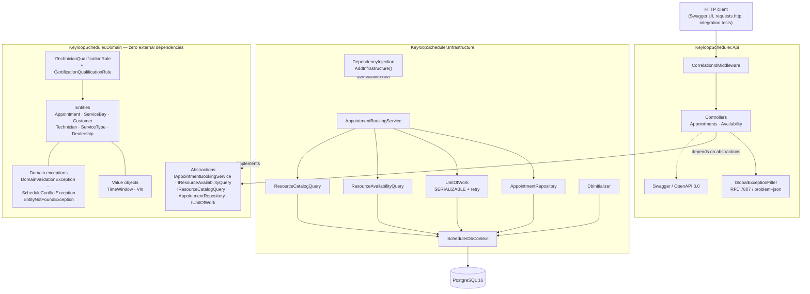
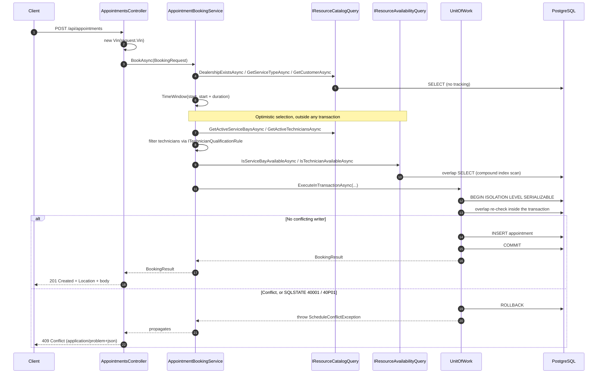
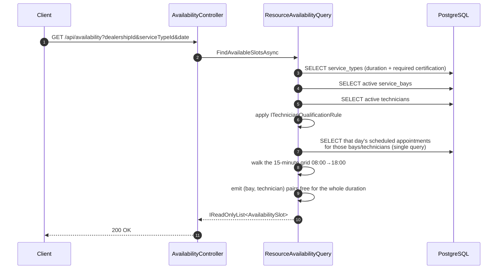
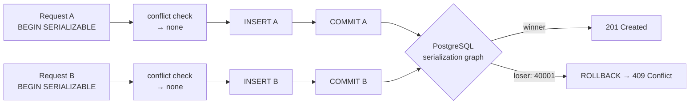

# System Design — Keyloop Unified Service Scheduler

**Scenario A: The Unified Service Scheduler (Ownership Domain)**

A resource-constrained automotive appointment scheduling engine. Every booking must
simultaneously reserve **two** scarce resources — a physical **service bay** and a
**certified technician** — for a contiguous interval, with zero tolerance for
double-booking under concurrency.

---

## 1. Component Architecture



### Layer responsibilities

| Layer | Owns | Depends on |
|---|---|---|
| **Domain** | Entities, value objects, domain rules, exceptions, and the **abstractions** the outside depends on | *Nothing* — not EF Core, not ASP.NET, not Npgsql |
| **Infrastructure** | EF Core mapping, migrations, repositories, the serializable unit of work, the booking engine, seeding, DI composition | Domain |
| **Api** | HTTP negotiation, DTOs, error translation, Swagger, correlation IDs | Domain, Infrastructure |
| **Tests** | Tier 1 domain units, Tier 2 HTTP contracts, Tier 3 race simulation | All |

The dependency arrow never points inwards. `AppointmentBookingService` does not know
EF Core exists — it depends on `IAppointmentRepository`, `IUnitOfWork`,
`IResourceCatalogQuery`, `IResourceAvailabilityQuery` and `ITechnicianQualificationRule`,
all declared in the Domain.

---

## 2. End-to-End Data Flow

### 2.1 Booking an appointment



The **double check is the crux**: resource selection happens optimistically before the
transaction, and the conflict predicate is evaluated *again* inside a `SERIALIZABLE`
transaction immediately before the insert. Two clients may both pass the optimistic
check; only one can pass the in-transaction check or commit without a serialization
failure.

### 2.2 Availability search



Availability is intentionally read-only and decoupled from the write path, so it can
later be served by a read replica or a dedicated CQRS read model without touching the
booking engine.

### 2.3 Cancellation

`DELETE /api/appointments/{id}` loads the aggregate, calls `appointment.Cancel(nowUtc)`
(which transitions `Scheduled → Cancelled` and stamps `CancelledAtUtc`), and saves
inside the same transactional unit of work. Because every overlap predicate filters on
`Status = Scheduled`, cancellation releases both resources atomically.

---

## 3. Concurrency Strategy



Three independent safety nets, in order:

1. **SQL-side overlap predicate** — half-open interval test
   (`existing.start < candidate.end AND candidate.start < existing.end`) evaluated by
   PostgreSQL, never by pulling rows into memory.
2. **`SERIALIZABLE` isolation** — PostgreSQL's SSI detects the read/write dependency
   between two concurrent booking transactions and aborts one with SQLSTATE `40001`.
3. **Defence in depth** — `ScheduleConflictException` for a detected conflict and
   `DbUpdateConcurrencyException` are both mapped to `409`, and the row-level predicate
   is re-evaluated inside the transaction.

Contention classification walks the **entire inner-exception chain**, because EF Core
wraps the `PostgresException` in a `DbUpdateException`, which the retry strategy may then
wrap again in a transient-failure envelope. See `docs/ai-refinement-log.md` — this was
a real defect found by the Tier 3 suite and is the single most important correctness fix
in the project.

### Why `SERIALIZABLE` + in-transaction re-check, not `SELECT … FOR UPDATE`

The write path must prevent a **phantom**: two concurrent bookings both observe "no
overlapping appointment exists" and both insert. The obvious pessimistic tool —
`SELECT … FOR UPDATE` over the `appointments` table — cannot solve that shape of problem,
because **there is no row to lock**. `FOR UPDATE` locks the rows a query already returns;
when the slot is genuinely free the overlap predicate returns the empty set, so there is
nothing to lock and both transactions proceed to insert. The classic workaround is to
lock the *resource* rows instead (`SELECT … FROM service_bays WHERE id = @bay FOR UPDATE`,
likewise for the technician), but that trades one problem for several:

| | `SELECT … FOR UPDATE` on resource rows | `SERIALIZABLE` + in-transaction re-check |
|---|---|---|
| Closes the phantom? | Only indirectly — by serialising on a surrogate row, not on the predicate | Yes — SSI tracks the read predicate, so an insert that would change the predicate's result is a conflict |
| Lock ordering | Required. Bay and technician must always be locked in the same order on every write path (book, cancel, reschedule) or deadlocks (`40P01`) appear under load | Not required. SSI detects and aborts; there is no lock-order invariant to preserve |
| Contention granularity | Coarse. Every booking for Bay 1 serialises on Bay 1's row — even two disjoint windows (09:00–09:30 and 15:00–16:30) that do not actually conflict | Fine. Transactions run concurrently and are aborted only when a genuine read/write dependency cycle exists |
| Blocking vs. fail-fast | Waiters block on the lock, holding a pooled connection for an unbounded time | Losers fail fast at commit with `40001`/`40P01`, surfaced deterministically as `409`; no connection sits waiting |
| Dual-resource rule | Two lock acquisitions to order and hold | One predicate that covers both resources |
| Failure path | Deadlock and lock-timeout handling, lock-timeout tuning, retry classification | One classification (`IsContention`) walking the inner-exception chain → one deterministic `409` |

Three properties make the serializable design decisive here:

1. **The conflict is a predicate, not a row.** "No appointment overlaps this window for
   this bay or this technician" protects the *absence* of rows. PostgreSQL's Serializable
   Snapshot Isolation implements predicate locking, so the in-transaction
   `HasResourceConflictAsync` re-check is not redundant belt-and-braces on top of
   isolation — it is the read whose result SSI re-validates at commit. Two transactions
   may both read "clean" and both insert, and SSI still aborts exactly one with `40001`.
   Crucially, the re-check is only load-bearing *because* it runs under `SERIALIZABLE`;
   under `READ COMMITTED` the same second read would see nothing and prevent nothing.
2. **The dual-resource rule composes better as a predicate than as locks.** A booking
   reserves a bay *and* a technician. Expressed as one `EXISTS` query with `OR` across the
   two resource columns it is a single serializable read; expressed as row locks it is two
   acquisitions that must be globally ordered, and every future writer (cancel, reschedule,
   a bulk import) must obey the same order or reintroduce deadlocks.
3. **The failure mode is explicit and testable.** SSI turns contention into a specific,
   catchable SQLSTATE, which the unit of work classifies into `ScheduleConflictException`
   → `409`. Tier 3 asserts the contract directly: under N simultaneous contenders for one
   slot, exactly one `201`, the rest `409`, exactly one row. A lock-based design has no
   comparable single failure signal — it has blocking, timeouts, and deadlocks to reason
   about instead.

**The honest trade-off.** SSI is optimistic: it can abort a transaction that had no real
conflict (a false positive) and the loser forfeits its retried work, whereas pessimistic
locking is predictable and never wastes a committed attempt. On a pathologically hot slot
with hundreds of contenders, a correctly-ordered `FOR UPDATE` design can be cheaper,
because it queues rather than burns and retries work. That trade is accepted here because
appointment booking is not one hot slot — the realistic load is many bays and technicians
across a day, where fine-grained predicate locking wins on throughput — and because the
deterministic `409` gives clients a clean, well-defined recovery path (re-query
availability). The natural future hardening steps — a `tstzrange` column with a GiST
exclusion constraint, or `SERIALIZABLE` *plus* advisory locks for a known hot slot — are
recorded in the trade-off table below.

---

## 4. Persistence

### Schema

| Table | Notes |
|---|---|
| `dealerships` | Ownership root |
| `service_bays` | `is_active` flag participates in availability |
| `technicians` | `certifications integer[]` — native PostgreSQL array so "holds certification X" is answered in SQL |
| `customers` | `full_name`, `email`, `is_active` — the customer each appointment is booked for |
| `service_types` | `duration_minutes`, `required_certification` |
| `appointments` | `start_time_utc` / `end_time_utc` as `timestamptz`, `vin` via value conversion, `status` as text, `customer_id` FK |

### Indexes (mandated, present across the migrations)

```
ix_appointments_bay_window                 (service_bay_id, start_time_utc, end_time_utc)
ix_appointments_technician_window          (technician_id, start_time_utc, end_time_utc)
ix_appointments_dealership_status_start    (dealership_id, status, start_time_utc)
ix_service_bays_dealership_active          (dealership_id, is_active)
ix_technicians_dealership_active           (dealership_id, is_active)
ix_customers_dealership_active             (dealership_id, is_active)
```

The two window indexes match the overlap predicate's shape so contention checks are
index scans rather than full table scans.

### Interval modelling

The domain owns intervals through the immutable `TimeWindow` record struct, which
validates UTC kind, ordering, and all interval math (`OverlapsWith`, `IsAdjacentTo`,
`Contains`, `Encloses`). It is persisted as two `timestamptz` columns rather than an
opaque range type specifically so the mandated compound indexes stay usable and the
overlap predicate translates cleanly to SQL.

---

## 5. Domain Invariants

1. **Dual-resource allocation** — an appointment is valid only if both a compatible bay
   and a certified technician are unbooked for the entire duration.
2. **Certification gate** — `Technician.Certifications` must contain
   `ServiceType.RequiredCertification`; enforced through the pluggable
   `ITechnicianQualificationRule` (open/closed).
3. **Business hours & quantization** — 08:00–18:00 UTC, single day, starts on a
   15-minute boundary.
4. **Strict UTC** — every timestamp is `DateTimeKind.Utc`; `DateTime.Now` is banned and
   the clock is abstracted behind `TimeProvider`.
5. **Deterministic VIN** — 17 characters, uppercase alphanumerics excluding I, O, Q.
6. **Only `Scheduled` occupies resources** — `Cancelled` and `Completed` release them.
7. **No bookings in the past** — enforced in `Appointment.Schedule` against the injected
   clock.
8. **Customer association** — a confirmed appointment persists the customer alongside the
   vehicle (VIN), service bay and technician; the customer must exist, be active, and
   belong to the booking dealership (Scenario A requirement 3).

---

## 6. Chosen Technologies & Trade-offs

| Decision | Chosen | Rejected alternative | Rationale |
|---|---|---|---|
| Runtime | **.NET 8 LTS** | .NET 9 / 10 | Assessment mandates .NET 8 LTS strictly |
| Isolation | **`Serializable` + in-transaction re-check** | `SELECT ... FOR UPDATE` row locks | `FOR UPDATE` cannot lock the rows a free slot lacks, so it must serialise on surrogate resource rows; SSI tracks the conflict predicate itself, needs no lock ordering discipline, and scales better. The retry-on-`40001` path is explicit and testable — see §3 |
| Interval persistence | **Two `timestamptz` columns** | `tstzrange` + GiST exclusion constraint | Keeps the mandated compound indexes usable and the predicate portable; the `tstzrange` approach would be the natural next hardening step |
| Transaction boundary | **`IUnitOfWork.ExecuteInTransactionAsync`** | `DbContext.Database.BeginTransaction` in the service | Keeps EF Core out of the application service (DIP) |
| Clock | **`TimeProvider`** | `DateTime.UtcNow` | Deterministic tests |
| Qualification | **`ITechnicianQualificationRule`** | Inline certification comparison | New certification policies without touching the engine (OCP) |
| Read/write surfaces | **Separate `IResourceAvailabilityQuery` / `IAppointmentBookingService`** | Single god-service | ISP + a clean path to CQRS / read replicas |
| Error contract | **RFC 7807 `problem+json` everywhere** | Ad-hoc error JSON | Uniform, machine-readable errors including model-binding failures |
| Test DB | **Testcontainers `postgres:16`** | In-memory provider / SQLite | Behaviour under real PostgreSQL isolation and SQL semantics is the thing being tested |
| Retry | **`EnableRetryOnFailure` + explicit contention classification** | No retries | Satisfies the reliability requirement while still converting serialization failures into deterministic `409`s |

### Documented trade-offs and known limitations

- **Bay capability is not modelled.** AGENTS.md only mandates a *technician* gate, so
  all bays are treated as compatible with all services ("compatible bay" = free bay).
  Adding a bay-specialisation rule is a natural extension via a second pluggable rule.
- **Serializable retries add latency to the losing request.** The loser may be retried
  by EF before the failure is classified, so a contended request is slower than an
  uncontended one. Conflicts are expected outcomes for clients, and correctness is
  unaffected.
- **Availability returns a cartesian product.** Each free `(bay, technician)` pair per
  slot is returned, which is correct but can be verbose. A paginated or
  "best pairing only" projection would reduce payload size.
- **Migrations run at startup in Development only.** Production would apply migrations
  as a separate deployment step.
- **No authentication or authorization.** Out of scope for Scenario A.
- **UTC-only business hours.** Dealership-local opening hours and DST handling are not
  modelled.
- **No appointment rescheduling endpoint.** `Appointment.Reschedule` exists and is unit
  tested, but is not yet exposed over HTTP.

---

## 7. Observability & Monitoring Plan

### Implemented

- **Structured JSON logs.** `AddJsonConsole` with `IncludeScopes` and UTC timestamps —
  verified that every emitted line parses as JSON.
- **Correlation IDs.** `CorrelationIdMiddleware` honours an incoming `X-Correlation-Id`,
  generates one when absent, pushes it into the log scope, sets `HttpContext.TraceIdentifier`,
  and echoes it on the response. It is also surfaced as `traceId` inside every
  `problem+json` body, so a client-reported error maps directly to server logs.
- **Booking outcome telemetry.** Every booking emits
  `Booking outcome {Outcome} DealershipId ServiceTypeId ServiceBayId TechnicianId AppointmentId DurationMs`,
  with `Outcome = Booked` (Information) or `Outcome = Conflict` (Warning).
- **Conflict logging.** The unit of work logs a warning with the PostgreSQL `SqlState`
  whenever contention forces a rollback.
- **ASP.NET Core request diagnostics.** Method, path, status code and elapsed
  milliseconds per request, plus built-in `TraceId`/`SpanId` scopes.
- **Health probe.** `GET /health`.

### Monitoring plan

| Signal | Source | Alert |
|---|---|---|
| Conflict rate | count of `Outcome = Conflict` vs `Outcome = Booked` | Spike indicates hot-spot slots or retry storms |
| p95 booking latency | `DurationMs` on booking outcomes + request diagnostics | Regression in the transactional path |
| Serialization failures | `SqlState = 40001` warnings | Sustained rate implies contention beyond design assumptions |
| Deadlocks | `SqlState = 40P01` warnings | Should be near zero; SSI makes them rare |
| 5xx rate | `GlobalExceptionFilter` errors | Any unexpected 500 is a defect |
| Index health | `pg_stat_user_indexes` on the window indexes | Unused/duplicated indexes |

For production, the JSON formatter maps directly onto a log pipeline (e.g. Serilog +
OpenTelemetry export to an APM) with no application changes, and the existing
`TraceId`/`CorrelationId` scope keys provide the join between logs and traces.

---

## 8. Test Strategy

| Tier | Project location | Count | Infrastructure | Category filter |
|---|---|---|---|---|
| **1 — Domain units** | `Domain/` | 79 cases | None (in-memory) | `Category=Domain` |
| **2 — Integration & contract** | `Integration/` | 27 cases | `WebApplicationFactory<Program>` + Testcontainers `postgres:16` | `Category=Integration` |
| **3 — Concurrency** | `Concurrency/` | 2 cases | Dedicated Testcontainers instance, trimmed to 1 bay + 1 technician | `Category=Concurrency` |

Tier 3 asserts that N simultaneous requests for the identical slot yield **exactly one
`201`**, the remainder **`409`**, and exactly one row — with a 10-round × 5-contender
regression guard and a zero-duplicate invariant query.

---

## 9. Generative AI Collaboration Summary

This solution was built with an AI coding agent (Sisyphus / OhMyOpenCode) under a
spec-first discipline driven by `AGENTS.md`.

**Division of labour.** The agent scaffolded the solution, installed and pinned the
toolchain (.NET 8 SDK was absent — only .NET 10 was present), authored the domain
contract, implemented Infrastructure and Api, and wrote all three test tiers. The human
retained every consequential decision: scope (vertical slice vs. full test suite),
test-database strategy, and acceptance of each design trade-off.

**Where the AI needed correction.** Four genuine defects were introduced and caught by
the process, all recorded in `docs/ai-refinement-log.md`:

1. **The concurrency misclassification (500 instead of 409).** This is the most
   instructive failure. The AI's first implementation inspected only one level of the
   inner-exception chain; EF Core's retry strategy wraps the `PostgresException` two
   levels deep. The Tier 3 suite caught it — but only *flakily*, roughly once in twenty
   runs, and the very first full run was green. Had that green run been trusted, the
   defect would have shipped. Only escalating to a 20-round × 6-contender stress harness
   made it reproducible, after which the fix (walk the whole chain) was verified across
   600 concurrent attempts.
2. **A missing spec requirement.** Tier 2 in `AGENTS.md` requires `400` for past dates;
   the domain did not enforce it. Writing the test exposed the gap.
3. **A silent no-op fix.** The first attempt at a uniform RFC 7807 error contract used
   `ObjectResult.ContentTypes`, which appeared to work in a unit assertion but was
   ignored at runtime for `ValidationProblemDetails`. Only live `curl` verification
   caught it; the working fix used `JsonResult.ContentType`.
4. **A required domain association that was never modelled — the customer.** Scenario A
   requirement 3 asks a confirmed appointment to associate the customer, vehicle,
   technician and service bay. The first pass modelled everything but the customer, because
   `AGENTS.md` — the contract the agent built and tested to — never named one. Because the
   same contract generated the tests, the suite could not detect the omission; it surfaced
   only on a deliberate re-read of the challenge PDF against the running system. A
   first-class `Customer` aggregate, a required `CustomerId`, a migration, seed data and
   new Tier 1/Tier 2 tests closed the gap.

**What worked well.** The frozen domain contract; writing tests as executable
specifications rather than afterthoughts; verifying claims against a real PostgreSQL
container and live HTTP calls instead of trusting green checkmarks; and treating
flakiness as a defect signal rather than noise.

**Process lesson.** The strongest signal in this build was not "tests pass" but
"tests pass *repeatedly under load*". A single green run of a concurrency suite is
close to worthless evidence. The second lesson is that a green suite only proves
conformance to the specification the agent was handed — when the source requirements and
the derived engineering contract diverge, only a direct re-read of the source finds the gap.
